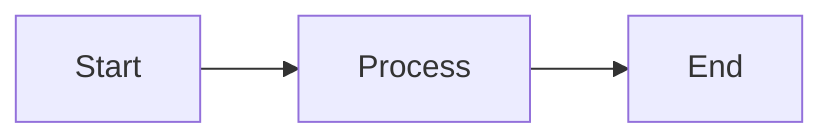

# Contributing to Ozwell Documentation

Thank you for your interest in improving the Ozwell documentation! This guide explains how to contribute.

## Ways to Contribute

- **Fix typos and errors** — Small corrections are always welcome
- **Improve clarity** — Help make explanations clearer
- **Add examples** — Practical code samples help developers
- **Report issues** — Found something confusing? Open an issue
- **Suggest improvements** — Ideas for new content or restructuring

---

## Getting Started

### Prerequisites

- Git
- Node.js 18+ (for local preview)
- A GitHub account

### Setup

1. Fork the repository on GitHub
2. Clone your fork:
   ```bash
   git clone https://github.com/YOUR_USERNAME/ozwellai-api.git
   cd ozwellai-api
   ```
3. Create a branch for your changes:
   ```bash
   git checkout -b docs/your-change-description
   ```

---

## Documentation Structure

```
docs/
├── overview.md              # Main entry point
├── CONTRIBUTING.md          # This file
├── SUMMARY.md               # Navigation/TOC
│
├── frontend/                # Client-side integration
│   ├── overview.md
│   ├── cdn/
│   │   └── README.md
│   ├── iframe/
│   │   └── README.md
│   └── frameworks/
│       ├── react/
│       ├── nextjs/
│       ├── vue3/
│       ├── vue2/
│       ├── svelte/
│       └── vanilla/
│
├── backend/                 # Server-side integration
│   ├── overview.md
│   └── api/
│       ├── README.md
│       └── reference/
│           ├── endpoints.md
│           ├── authentication.md
│           └── examples.md
│
└── assets/                  # Images, diagrams, etc.
```

---

## Writing Guidelines

### Style

- **Be concise** — Get to the point quickly
- **Use active voice** — "Create a file" not "A file should be created"
- **Address the reader as "you"** — Makes docs more personal
- **Use present tense** — "This returns..." not "This will return..."

### Formatting

- Use **Markdown** for all documentation
- Use **Mermaid** for diagrams (not ASCII art)
- Use **fenced code blocks** with language hints
- Use **tables** for structured data
- Use **admonitions** sparingly (⚠️, ✅, ❌)

### Code Examples

- Keep examples **minimal but complete**
- Show **imports** where relevant
- Use **TypeScript** for typed examples
- Include **error handling** in production examples
- Test your code before submitting

```typescript
// ✅ Good: Complete, testable example
import { OzwellClient } from '@ozwell/api';

const client = new OzwellClient({
  apiKey: process.env.OZWELL_API_KEY,
});

const response = await client.chat.completions.create({
  model: 'gpt-4',
  messages: [{ role: 'user', content: 'Hello!' }],
});

console.log(response.choices[0].message.content);
```

### Diagrams

Use Mermaid for diagrams:

````markdown

````

---

## Making Changes

### Small Changes

For typos, small fixes, or minor improvements:

1. Edit the file directly on GitHub
2. Submit a pull request with a clear description

### Larger Changes

For new sections, significant rewrites, or new features:

1. Open an issue first to discuss the change
2. Wait for feedback before investing significant time
3. Follow the PR process below

---

## Pull Request Process

1. **Create a descriptive branch name:**
   ```bash
   git checkout -b docs/add-python-examples
   ```

2. **Make your changes** following the guidelines above

3. **Commit with clear messages:**
   ```bash
   git commit -m "docs: add Python examples to backend section"
   ```

4. **Push to your fork:**
   ```bash
   git push origin docs/add-python-examples
   ```

5. **Open a Pull Request** with:
   - Clear title describing the change
   - Description of what and why
   - Link to any related issues

6. **Respond to feedback** from reviewers

---

## Commit Message Format

Use conventional commits:

```
docs: add streaming examples to backend docs
docs: fix typo in React integration guide
docs: improve authentication section clarity
```

Prefixes:
- `docs:` — Documentation changes
- `fix:` — Bug fixes in docs
- `feat:` — New documentation sections

---

## Review Process

All documentation changes go through review:

1. **Automated checks** — Linting, link validation
2. **Human review** — At least one maintainer reviews
3. **Feedback** — Reviewers may request changes
4. **Merge** — Once approved, changes are merged

---

## Local Preview

To preview documentation locally:

```bash
# Install dependencies
npm install

# Start local server (if configured)
npm run docs:dev
```

---

## Reporting Issues

Found a problem? Open an issue with:

- **Clear title** describing the issue
- **Location** — Which page/section has the problem
- **Description** — What's wrong or confusing
- **Suggestion** — How it could be improved (optional)

---

## Code of Conduct

- Be respectful and constructive
- Focus on the content, not the person
- Welcome newcomers
- Assume good intentions

---

## Questions?

- Open a GitHub Discussion for general questions
- Tag `@maintainers` in issues if urgent
- Check existing issues before creating new ones

Thank you for helping improve Ozwell's documentation! 🎉
