# Live Demo: Ozwell in Action

Experience Ozwell's privacy-first chat widget in a real application before integrating it into your own project.

## 🎬 Try the Demo

**Important:** These are example applications that have already integrated Ozwell. They are NOT the Ozwell API itself—they are sample websites showing how YOUR site could integrate Ozwell.

**[Live Demo Site](https://ozwellai-embedtest.opensource.mieweb.org/)** - A simple example application showing the widget integration in action. This demonstrates how you could add Ozwell to any basic webpage.

**[Tic-Tac-Toe Demo](https://ozwellai-embedtest.opensource.mieweb.org/tictactoe.html)** - A game application that has integrated Ozwell. Shows how the widget can be embedded in any interactive web application and communicate with the host page.

These demo applications show what YOUR site will look like after integrating Ozwell with just a few lines of code, with full privacy for user conversations.

---

## What You're Seeing

This demo site is a standalone web application that showcases how Ozwell's chat widget integrates into real-world websites.

### The Application
The demo is a simple standalone web page that represents any typical website or web application. It could be:
- A marketing website
- A documentation site
- A product landing page
- An internal business application

### The Ozwell Widget
Look for the chat widget (typically in the bottom-right corner). This is Ozwell's **Option 1: Pre-built Widget** integration—the fastest way to add AI chat to your site.

---

## How It Works: Integration Architecture

```mermaid
graph TB
    subgraph "Demo Site (Your Application)"
        Page[🌐 Demo Web Page<br/>ozwellai-embedtest.opensource.mieweb.org]
        Script[📜 Embed Script Tag]
        Page -->|Contains| Script
    end
    
    subgraph "Ozwell Infrastructure"
        Widget[💬 Ozwell Chat Widget]
        API[☁️ Ozwell API<br/>ozwellai-api]
        Agent[🤖 Configured Agent]
        
        Script -.->|Loads| Widget
        Widget -->|Uses Scoped API Key| API
        API -->|Routes to| Agent
    end
    
    User[👤 You] -->|Visit & Chat| Page
    
    style Widget fill:#e3f2fd
    style API fill:#e3f2fd
    style Agent fill:#e3f2fd
    style Page fill:#fff9c4
```



### The Integration Process

1. **The Demo Site** includes a simple script tag (Option 1 integration)
2. **The Script** loads Ozwell's widget in an isolated iframe
3. **The Widget** connects to the Ozwell API using a **scoped API key**
4. **The API** routes your messages to a pre-configured **agent**
5. **Your Conversation** stays private—the demo site cannot see your messages

---

## What to Try

### 1. **Start a Conversation**
Click the chat widget and ask it questions:
- "What is Ozwell?"
- "How does this demo work?"
- "What can you help me with?"

### 2. **Notice the Privacy**
Pay attention to how the chat works:
- ✅ Your messages are private by default
- ✅ The demo site cannot intercept or log your conversation
- ✅ You're chatting in Ozwell's secure environment, not the host site's

### 3. **Test Sharing (Optional)**
If the demo has sharing features enabled, notice:
- You must explicitly choose to share information
- Sharing is always opt-in, never automatic
- You control what data (if any) goes to the host site

---

## The Code Behind It

This demo uses **Option 1: CDN Embed** integration—the simplest way to add Ozwell to any website.

### All It Takes

```html
<!DOCTYPE html>
<html>
<head>
  <title>My Website</title>
</head>
<body>
  <h1>Welcome to My Site</h1>
  
  <!-- That's it! Just add this script tag -->
  <script 
    src="https://cdn.ozwell.ai/embed.js" 
    data-api-key="ozw_scoped_xxxxx"
    data-agent-id="agent_xxxxx"
  ></script>
</body>
</html>
```

### What the Script Does

1. Loads the Ozwell widget UI
2. Authenticates with your scoped API key
3. Connects to your configured agent
4. Renders the chat interface in an isolated iframe
5. Handles all communication with the Ozwell API

**No backend required.** No complex setup. Just one script tag.

---

## API Key Security

### Scoped Keys Are Client-Safe

The demo uses a **scoped API key**—specifically designed to be safe in client-side code:

| Feature | Scoped Key (Demo) | General-Purpose Key |
|---------|-------------------|---------------------|
| **Safe in HTML?** | ✅ Yes | ❌ No |
| **Scope** | Single agent only | Full API access |
| **Permissions** | Limited to agent config | Unrestricted |
| **Rate Limits** | Per-agent limits | Account-wide |
| **Use Case** | Frontend widgets | Backend servers |

This is why you can safely embed the widget on any public website—the key only works with the specific agent it's configured for.

---

## Integration Options Compared

This demo shows **Option 1**, but there are three ways to integrate:

| Option | What Demo Shows | Alternative Approaches |
|--------|----------------|------------------------|
| **Option 1** | ✅ **This demo uses it**<br/>Pre-built widget | None needed—this is the simplest path |
| **Option 2** | ❌ Not shown<br/>Custom UI + Backend | You'd build your own chat interface<br/>Call Ozwell API from your server |
| **Option 3** | ❌ Not shown<br/>Backend API only | No visible UI<br/>Pure server automation |

➡️ **Learn more:** [Integration Paths Guide](./integration-paths.md)

---

## Privacy Model in Action

### What the Demo Site CAN'T Do

When you chat with Ozwell on the demo site, the host site **cannot**:
- ❌ See your messages
- ❌ Log your conversation
- ❌ Intercept or modify your chat
- ❌ Track what you're asking about

### What the Demo Site CAN Do

The demo site **can only**:
- ✅ Detect that the widget opened/closed (lifecycle events)
- ✅ Receive information you **explicitly choose to share**
- ✅ See that you're using Ozwell (the widget is visible)

This is **privacy by default**—the conversation stays between you and Ozwell unless you decide otherwise.

---

## Try It Yourself

Ready to add Ozwell to your own site?

### Quick Start (5 minutes)

1. Get your API keys from the Ozwell dashboard
2. Add the script tag to your HTML
3. Customize the widget styling (optional)
4. Deploy!

➡️ **Start here:** [CDN Embed Guide](./frontend/cdn-embed.md)

### Production Apps (15 minutes)

For React, Vue, Next.js, or other frameworks:

➡️ **Framework guides:** [Frontend Integration](./frontend/overview.md)

### Custom Implementations (1-2 hours)

Want to build your own chat interface?

➡️ **Backend API:** [Integration Paths Guide](./integration-paths.md)

---

## Questions?

- **How do I get API keys?** Contact us to set up your account
- **Can I customize the widget?** Yes! See [styling documentation](./frontend/cdn-embed.md)
- **Is this really private?** Yes. See our [privacy architecture](./overview.md#privacy-first-why-it-matters)
- **What's under the hood?** Explore the [Ozwell API documentation](./backend/api-overview.md)

---

## Demo Source Code

Want to see exactly how the demo site works?

The demo is part of this repository:
- **Location:** `/landing-page/` directory
- **Main file:** `landing-page/public/landing.html`
- **Embed script:** `reference-server/embed/ozwell-loader.js`

You can run it locally:

```bash
cd landing-page
npm install
npm start
# Visit http://localhost:8080
```

This gives you a local version to experiment with before deploying to your own site.
