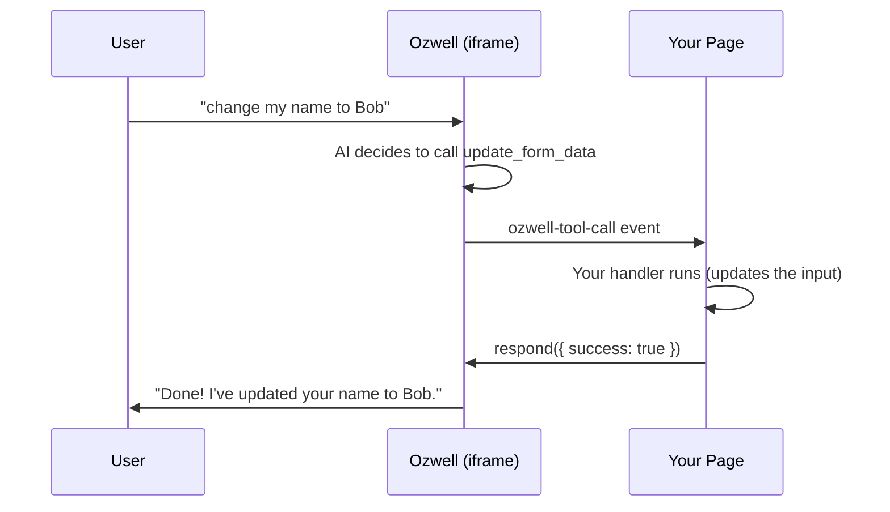

# CDN Embed Integration

The fastest way to add Ozwell to any website. No build step, no framework required — just a single script tag.

## Quick Start

:::info Getting an Agent Key
To get an API key and create an agent, see the [Agent Registration API](../backend/agents.md) or contact **`adamerla128@gmail.com`**.
:::

Add this snippet to your HTML, just before the closing `</body>` tag:

```html
<!-- Development server (current) -->
<script>
  window.OzwellChatConfig = { apiKey: 'agnt_key-your-agent-key' };
</script>
<script src="https://ozwell-dev-refserver.opensource.mieweb.org/embed/ozwell-loader.js"></script>

<!-- Production (coming soon) -->
<!--
<script 
  src="https://cdn.ozwell.ai/embed.js" 
  data-api-key="agnt_key-your-agent-key"
></script>
-->
```

That's it! A chat widget will appear in the bottom-right corner of your page.

---

## Getting Your Credentials

Ozwell supports two authentication modes:

### Option A: Agent Key (Recommended)

Agent keys connect to a server-side agent definition that manages the system prompt, model, temperature, and allowed tools.

1. Get an API key (`ozw_` prefix) — contact **`adamerla128@gmail.com`** or **`horner@mieweb.com`**
2. Create an agent via the [Agent Registration API](../backend/agents.md)
3. Copy the **Agent Key** from the response (starts with `agnt_key-`)
4. Use it in the embed config

### Option B: Parent API Key

Parent keys give you raw completions access — you provide the system prompt, model, and tools inline in your client config.

1. Contact **`adamerla128@gmail.com`** or **`horner@mieweb.com`** for an API key
2. Use the key directly (starts with `ozw_`)

*Self-service key creation via the [Ozwell Dashboard](https://dashboard.ozwell.ai) is coming soon.*

---

## Configuration Options

:::caution Coming Soon
The `data-*` attribute configuration method is not yet supported. Use `window.OzwellChatConfig` (shown above) for now.
:::

Customize the widget using `data-*` attributes:

```html
<script 
  src="https://cdn.ozwell.ai/embed.js" 
  data-api-key="agnt_key-your-agent-key"
  data-theme="dark"
  data-position="bottom-left"
  data-primary-color="#10b981"
  data-auto-open="false"
  data-greeting="Hi! How can I help you today?"
></script>
```

### Available Options

| Attribute | Type | Default | Description |
|-----------|------|---------|-------------|
| `data-api-key` | string | *required* | Agent key (`agnt_key-...`) or parent key (`ozw_...`) |
| `data-theme` | `"light"` \| `"dark"` \| `"auto"` | `"auto"` | Color theme |
| `data-position` | `"bottom-right"` \| `"bottom-left"` | `"bottom-right"` | Widget position |
| `data-primary-color` | string (hex) | `"#4f46e5"` | Accent color |
| `data-width` | string | `"400px"` | Chat window width |
| `data-height` | string | `"600px"` | Chat window height |
| `data-auto-open` | `"true"` \| `"false"` | `"false"` | Open on page load |
| `data-greeting` | string | Agent default | Initial greeting message |
| `data-placeholder` | string | `"Type a message..."` | Input placeholder |
| `data-button-icon` | string (URL) | Ozwell logo | Custom launcher icon |

---

## JavaScript API

The embed script exposes a global `OzwellChat` object for programmatic control:

### Open/Close the Widget

```javascript
// Open the chat window
OzwellChat.open();

// Close the chat window
OzwellChat.close();

// Toggle open/closed (coming soon)
// OzwellChat.toggle();
```

### Update Context

```javascript
// Set context data (passed to the agent)
OzwellChat.updateContext({
  userId: 'user_123',
  page: window.location.pathname,
  customData: { ... }
});

// Send a message as the user (coming soon)
// OzwellChat.sendMessage('Hello, I need help with...');
```

### Events

**Privacy Note:** Ozwell respects user privacy. The host site receives only lifecycle events—never conversation content. Users can ask anything without fear of surveillance.

```javascript
// Widget is ready
window.addEventListener('ozwell:ready', () => {
  console.log('Widget loaded');
});

// Chat window opened
window.addEventListener('ozwell:open', () => {
  analytics.track('Chat Opened');
});

// Chat window closed
window.addEventListener('ozwell:close', () => {
  analytics.track('Chat Closed');
});

// User explicitly shared data (opt-in only)
window.addEventListener('ozwell:user-share', (event) => {
  // Only fires when user chooses to share
  console.log('User shared:', event.detail);
});
```

⚠️ **No message content events:** `ozwell:message` and `ozwell:user-message` do not exist. Conversation content is private between the user and Ozwell.

---

## Tool Calling

This is the big one. Ozwell can do more than chat — it can **take actions on your page**. When a user says "update my email to bob@example.com," Ozwell's AI can call a function *you* define that actually updates the form field.

Here's how it works:



The Ozwell widget runs in a sandboxed iframe. It **cannot** touch your page directly — no DOM access, no cookies, no JavaScript variables. Instead, when the AI decides to use a tool, the widget sends an `ozwell-tool-call` event to your page. Your code runs the action and sends a result back. The AI then uses that result to respond to the user.

### Step 1: Load the Widget with an Agent Key

Your agent definition (created via the [Agent Registration API](../backend/agents.md)) includes the tools Ozwell can offer. The widget discovers them automatically.

```html
<script>
  window.OzwellChatConfig = { apiKey: 'agnt_key-your-agent-key' };
</script>
<script src="https://ozwell-dev-refserver.opensource.mieweb.org/embed/ozwell-loader.js"></script>
```

That's the same script tag from [Quick Start](#quick-start). If your agent has tools defined, they just work — the widget discovers them during its MCP handshake with the server.

### Step 2: Handle Tool Calls

When the AI calls one of your tools, the loader dispatches an `ozwell-tool-call` DOM event on `document`. Listen for it and call `respond()` with the result:

```javascript
document.addEventListener('ozwell-tool-call', (e) => {
  const { name, arguments: args, respond } = e.detail;

  if (name === 'update_form_data') {
    // Do whatever you want — update inputs, call your own API, etc.
    if (args.name) document.getElementById('input-name').value = args.name;
    if (args.email) document.getElementById('input-email').value = args.email;

    // Tell Ozwell what happened
    respond({ success: true, message: 'Fields updated' });

  } else if (name === 'get_form_data') {
    // Tools can also READ from your page
    respond({
      success: true,
      data: {
        name: document.getElementById('input-name').value,
        email: document.getElementById('input-email').value
      }
    });
  }
});
```

**You must call `respond()`.** The AI is waiting for the result. If you don't respond, the conversation will hang.

### Step 3: That's It

There is no step 3. The loader handles the MCP protocol, JSON-RPC messages, and postMessage plumbing. You write normal JavaScript in a normal event listener.

### What Goes in the Agent Definition vs. Your Page

| Concern | Where It Lives | Who Manages It |
|---------|----------------|----------------|
| Tool names and descriptions | Agent definition (server) | You, via the [Agent API](../backend/agents.md) |
| Parameter schemas (what inputs the tool accepts) | Agent definition (server) | You, via the Agent API |
| System prompt ("you are a helpful assistant…") | Agent definition (server) | You, via the Agent API |
| **What happens when a tool is called** | **Your page (client)** | **Your JavaScript** |

The AI sees the tool name, description, and parameter schema to decide *when* to call a tool and *what arguments* to pass. Your page decides *what to do* with those arguments.

### Alternative: Define Tools Inline (Parent Key)

If you're using a parent API key (`ozw_...`) instead of an agent key, you can define tools directly in your page config. This gives you full client-side control but means you also need to provide the system prompt and model yourself:

```html
<script>
  window.OzwellChatConfig = {
    apiKey: 'ozw_your-api-key',
    model: 'qwen2.5-coder:3b',
    system: 'You are a helpful assistant for managing user profiles.',
    tools: [{
      type: 'function',
      function: {
        name: 'update_form_data',
        description: 'Updates user profile fields on the page',
        parameters: {
          type: 'object',
          properties: {
            name:  { type: 'string', description: 'New display name' },
            email: { type: 'string', description: 'New email address' }
          },
          required: []
        }
      }
    }]
  };
</script>
<script src="https://ozwell-dev-refserver.opensource.mieweb.org/embed/ozwell-loader.js"></script>
```

You still handle `ozwell-tool-call` the same way — the event listener code doesn't change.

### Security: What Crosses the Iframe Boundary

Understanding what data flows where:

| Data | Crosses the boundary? | Direction |
|------|----------------------|-----------|
| Tool call name + arguments | ✅ Yes | Ozwell → Your page |
| Tool result (your `respond()`) | ✅ Yes | Your page → Ozwell |
| User's chat messages | ❌ No | Stays in iframe |
| AI's text responses | ❌ No | Stays in iframe |
| Your page's DOM, cookies, JS | ❌ No | Stays on your page |

The AI can only call tools you've defined. It cannot access your page's DOM, make arbitrary network requests from your origin, or read anything you haven't explicitly returned via `respond()`.

### Tips

- **Write good tool descriptions.** The AI reads them to decide when to use a tool. "Updates user profile fields on the page" is better than "updates stuff."
- **Validate arguments.** The AI usually gets the schema right, but treat the incoming `args` like any untrusted input — check types and ranges before acting on them.
- **Return useful results.** The AI uses `respond()` data to craft its reply. If you return `{ success: true }`, the AI can only say "done." If you return `{ success: true, message: "Name changed from Alice to Bob" }`, the AI can confirm the details.
- **Use `debug: true` during development.** It shows tool execution pills in the chat UI so you can see what's happening.

For the full postMessage protocol details (useful if you're building a custom integration without the loader), see the [Embed Widget README](https://github.com/mieweb/ozwellai-api/tree/main/reference-server/embed). For the design inspiration behind this architecture, see [MCP postMessage Standard](./mcp-postmessage-standard.md).

---

## Examples

:::note Current Script URLs
The examples below use `cdn.ozwell.ai/embed.js` which is the future production CDN. For now, use:

- **Dev:** `https://ozwell-dev-refserver.opensource.mieweb.org/embed/ozwell-loader.js`
- **Production:** `https://ozwellai-refserver.opensource.mieweb.org/embed/ozwell-loader.js`
:::

### Basic Embed

```html
<!DOCTYPE html>
<html>
<head>
  <title>My Website</title>
</head>
<body>
  <h1>Welcome to My Site</h1>
  <p>Content goes here...</p>
  
  <!-- Ozwell Chat Widget -->
  <script 
    src="https://cdn.ozwell.ai/embed.js" 
    data-api-key="agnt_key-your-agent-key"
  ></script>
</body>
</html>
```

### Dark Theme with Custom Position

```html
<script 
  src="https://cdn.ozwell.ai/embed.js" 
  data-api-key="agnt_key-your-agent-key"
  data-theme="dark"
  data-position="bottom-left"
  data-primary-color="#f59e0b"
></script>
```

### Auto-Open with Custom Greeting

```html
<script 
  src="https://cdn.ozwell.ai/embed.js" 
  data-api-key="agnt_key-your-agent-key"
  data-auto-open="true"
  data-greeting="👋 Welcome! I'm here to help you find what you're looking for."
></script>
```

### Triggered by Button Click

```html
<button onclick="OzwellChat.open()">Chat with Us</button>

<script 
  src="https://cdn.ozwell.ai/embed.js" 
  data-api-key="agnt_key-your-agent-key"
></script>
```

### Complete Page with Tool Calling

A full working example — an AI assistant that can read and update form fields on the page:

```html
<!DOCTYPE html>
<html>
<head>
  <title>My App — with Ozwell</title>
</head>
<body>
  <h1>User Profile</h1>
  <form id="profile-form">
    <label>Name: <input type="text" id="input-name" value="Alice Johnson" /></label><br/>
    <label>Email: <input type="email" id="input-email" value="alice@example.com" /></label><br/>
    <label>Zip:  <input type="text" id="input-zip" value="90210" /></label>
  </form>

  <!-- 1. Load Ozwell (agent key — tools defined server-side) -->
  <script>
    window.OzwellChatConfig = {
      apiKey: 'agnt_key-your-agent-key',
      welcomeMessage: 'Hi! I can view or update your profile. Just ask.',
      debug: true  // shows tool pills in chat — turn off in production
    };
  </script>
  <script src="https://ozwell-dev-refserver.opensource.mieweb.org/embed/ozwell-loader.js"></script>

  <!-- 2. Handle tool calls -->
  <script>
    document.addEventListener('ozwell-tool-call', (e) => {
      const { name, arguments: args, respond } = e.detail;

      if (name === 'get_form_data') {
        respond({
          success: true,
          data: {
            name: document.getElementById('input-name').value,
            email: document.getElementById('input-email').value,
            zip: document.getElementById('input-zip').value
          }
        });

      } else if (name === 'update_form_data') {
        if (args.name)  document.getElementById('input-name').value = args.name;
        if (args.email) document.getElementById('input-email').value = args.email;
        if (args.zip)   document.getElementById('input-zip').value = args.zip;
        respond({ success: true, message: 'Profile updated' });

      } else {
        respond({ success: false, error: `Unknown tool: ${name}` });
      }
    });
  </script>
</body>
</html>
```

Try saying: *"what's my name?"* or *"change my email to bob@example.com"*

---

## Security & Privacy

### Conversation Privacy

🔐 **Conversations are private by default.** The dialogue between users and Ozwell is never shared with the host site. Users can ask any question—even ones they might feel are "dumb"—knowing their conversation stays between them and Ozwell.

Sharing is always opt-in: only when a user explicitly chooses to share information does it become visible to the host site.

### API Key Requirements

⚠️ **Every widget instance requires a valid API key.** Use either:

- **Agent key** (`agnt_key-...`) — recommended; persona and tools managed server-side
- **Parent key** (`ozw_...`) — for advanced use; you provide all config inline

The widget will display a clear error if no key is configured.

### Domain Restrictions *(Coming Soon)*

For additional security, configure domain restrictions for your scoped key:

1. Go to **Settings → API Keys** in your dashboard *(coming soon)*
2. Edit your scoped key
3. Add allowed domains under **Domain Restrictions**
4. Only requests from listed domains will be accepted

### Content Security Policy (CSP)

If your site uses CSP headers, add Ozwell's domains:

```
Content-Security-Policy: 
  script-src 'self' https://cdn.ozwell.ai;
  frame-src 'self' https://embed.ozwell.ai;
  connect-src 'self' https://api.ozwell.ai;
```

---

## Troubleshooting

### Widget Not Appearing

1. **Check the console** for JavaScript errors
2. **Verify your API key** is valid and has correct permissions
3. **Check domain restrictions** if configured
4. **Ensure the script loads** after the page content

### Widget Appears But Chat Fails

1. **Check the error message** in the chat widget — it will show the specific auth error
2. **Verify your API key** starts with `agnt_key-` or `ozw_`
3. **Verify the agent key** exists via `curl GET /v1/agents` if using an agent key
4. **Review network tab** for 401 responses

### Styling Conflicts

The widget renders in an iframe, so styling conflicts are rare. If you need to adjust the container:

```css
/* Adjust the widget container position */
#ozwell-widget-container {
  z-index: 9999 !important;
}
```

---

## Next Steps

- [Agent Registration API](../backend/agents.md) — Create agents and define tools server-side
- [MCP postMessage Standard](./mcp-postmessage-standard.md) — The design ideas behind Ozwell's tool-calling architecture
- [Embed Widget README](https://github.com/mieweb/ozwellai-api/tree/main/reference-server/embed) — Raw postMessage protocol details for custom integrations
- [Framework Integration](./overview.md) — For React, Vue, Svelte apps
- [Iframe Details](./iframe-integration.md) — Deep dive on iframe security
- [Backend API](../backend/overview.md) — Server-side integration
