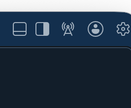
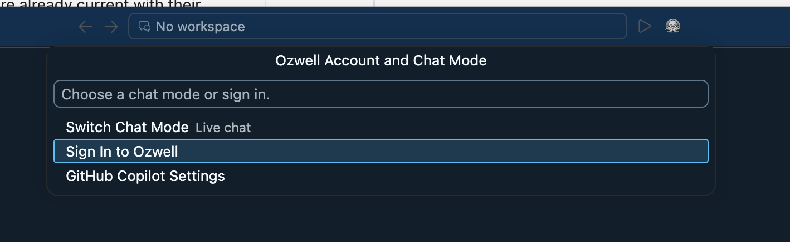
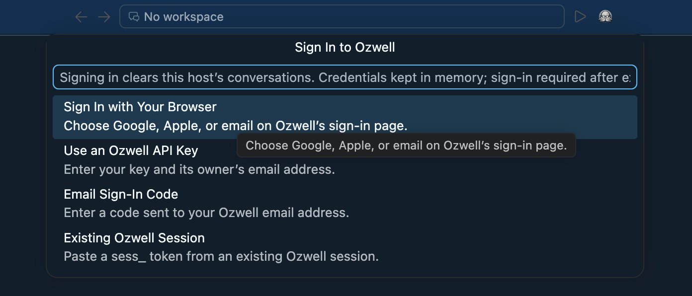
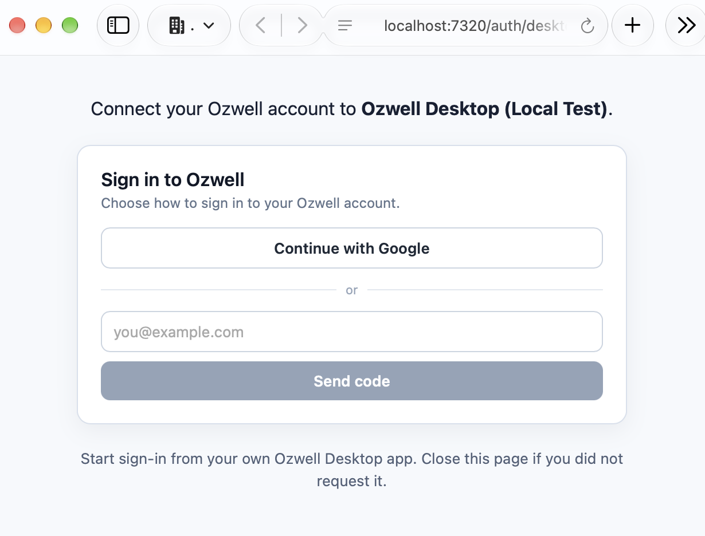
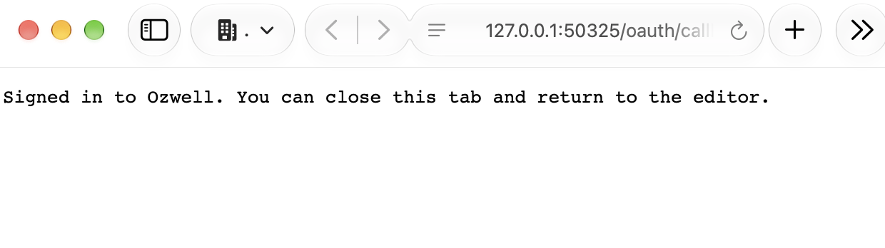

# Sign in to Ozwell Desktop

Start from the account menu in Ozwell Desktop. The app opens your system browser
so you can choose a sign-in method on the Ozwell server. Google, Apple, and email
sign-in create an **Ozwell session** with your account's existing permissions.

These screenshots were captured on October 6, 2026, using a development build
and the local API at `http://localhost:7320`. The displayed client name is
**Ozwell Desktop (Local Test)**. Your deployment's address, client name, and
enabled sign-in methods may differ. Use a Desktop build and API deployment that
both include desktop browser authentication.

## 1. Open the account menu

In the Agents window, click the **account icon** in the upper-right title bar:
the person inside a circle, immediately left of the gear.

## 2. Choose Sign In to Ozwell

In **Ozwell Account and Chat Mode**, select **Sign In to Ozwell**.

## 3. Choose Sign In with Your Browser

Select **Sign In with Your Browser**. Desktop starts the login attempt and opens
the server's sign-in page in your default browser. Keep Desktop running while
you complete the browser steps.

Signing in or changing accounts clears this host's in-memory conversations.

## 4. Sign in on the Ozwell page

Check that the page names the Ozwell Desktop client you started. For the Google
flow shown here, click **Continue with Google**, select your account in the
popup, and complete Google's sign-in prompts. The Ozwell server must allow that
account to sign in.

The page shows only the methods enabled by that server. If email sign-in is
available, enter your email, choose **Send code**, and enter the code delivered
by the server. Email delivery depends on the server's mail configuration; a
local development server may deliver the test code locally instead of emailing it.

## 5. Return to Desktop

After authentication, the browser returns to Desktop's temporary loopback
callback and shows:

> Signed in to Ozwell. You can close this tab and return to the editor.

Close that tab and return to Ozwell Desktop. The `127.0.0.1` address is a listener
on your own computer; its port changes between login attempts. Start each attempt
from Desktop so it can create and validate the callback and PKCE exchange.

## 6. Select a model and test chat

Open the account menu to confirm your account is connected. Use **Switch Chat
Mode** to select **Live Chat** if needed, then start a new conversation. Click
the **Models dropdown beneath the message box**, choose a chat model available
to your account, and send a short message.

The model list comes from the Ozwell server and can change with provider access
or account permissions. Some catalogs also include specialized image, audio, or
embedding models; choose a model that supports chat. **Refresh Models** in the
account menu reloads the server's current catalog.

## Use an Ozwell API key instead

At step 3, choose **Use an Ozwell API Key**. Enter the email associated with the
key, then your Ozwell key. The server verifies that the key belongs to that
active account. A parent or agent key retains its existing permissions.

Use an **Ozwell** key here. OpenAI and Anthropic provider keys are configured on
the Ozwell server.

## Sign out and sign in again

Choose **Sign Out** from the account menu. This forgets the credential in the
host and revokes an Ozwell session on the server; it does not revoke a personal
API key. Credentials entered through these sign-in options stay in host memory.
Restarting the host, or an expired or invalidated session, requires a fresh login.

Official Mac clients registered for Apple App Attest also verify their signed
build before receiving a session and attach proofs to authenticated requests.
This is separate from choosing Apple as a browser sign-in method. The screenshots
use a development client; they do not demonstrate release attestation.

## Troubleshooting

| What you see | What to check |
| --- | --- |
| **Sign In with Your Browser** is missing | The API must support desktop login and have a matching client registered. |
| Google or Apple is missing on the web page | That provider must be configured on the Ozwell server. |
| No email code arrives | Check the server's mail delivery. The local test launcher writes codes to its private `latest-code.json` file. |
| The browser attempt expires or its callback fails | Keep Desktop open and start a new attempt from its account menu. Complete one attempt at a time. |
| Sign-in succeeds but the model list is empty | Confirm Live Chat is selected, use **Refresh Models**, and check account/model permissions with the server operator. |
| A signed Mac build is rejected | Check the registered signing identity, approved build version, and App Attest platform requirements. |

For server setup and the HTTP contract, see
[desktop authentication deployment](../backend/desktop-authentication.md).
[Widget authentication deployment](../backend/widget-authentication.md) covers
Google, Apple, email delivery, and account admission. The Desktop repository has
[the same illustrated walkthrough](https://github.com/mieweb/ozwell-desktop/blob/codex/ozwell-browser-login/docs/desktop-login.md)
and [release registration and Apple attestation](https://github.com/mieweb/ozwell-desktop/blob/codex/ozwell-browser-login/docs/authentication-registration.md).
