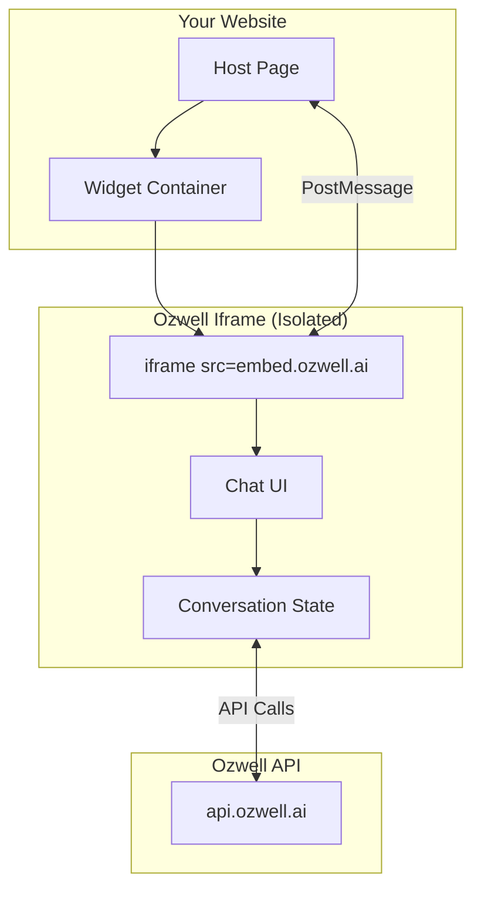

# Iframe Integration

This guide covers the iframe-based architecture used by all Ozwell frontend integrations, including security considerations, communication patterns, and custom implementation details.

## How It Works

Ozwell's frontend integrations render the chat interface inside an isolated iframe. This architecture provides:



## Privacy & Security Benefits

### Conversation Privacy

🔐 **The conversation between users and Ozwell is private by default.**

The host site cannot see, intercept, or log what is said in the chat. This creates a safe space where users can:

- Ask any question without embarrassment
- Explore topics freely without surveillance
- Trust that their dialogue stays between them and Ozwell

**Sharing is always opt-in.** Only when a user explicitly chooses to share information does it become visible to the host site.

### Origin Isolation

The iframe runs on a separate origin (`embed.ozwell.ai`), which means:

- ❌ Cannot access parent page DOM
- ❌ Cannot read parent page cookies/storage
- ❌ Cannot execute scripts in parent context
- ❌ Cannot access parent page JavaScript variables
- ❌ **Cannot read conversation content**

### Sandbox Attributes

The iframe includes restrictive sandbox attributes:

```html
<iframe 
  src="https://embed.ozwell.ai/..."
  sandbox="allow-scripts allow-same-origin allow-forms allow-popups"
  allow="clipboard-write"
></iframe>
```

| Attribute | Purpose |
|-----------|---------|
| `allow-scripts` | Required for chat functionality |
| `allow-same-origin` | Required for API calls from iframe |
| `allow-forms` | Enables form submission (file uploads) |
| `allow-popups` | Allows opening links in new tabs |

### Content Security Policy

The iframe enforces strict CSP headers:

```
Content-Security-Policy:
  default-src 'self';
  script-src 'self';
  style-src 'self' 'unsafe-inline';
  img-src 'self' data: https:;
  connect-src https://api.ozwell.ai;
  frame-ancestors https://*.your-domain.com;
```

---

## Communication Protocol

The host page and iframe communicate via the [PostMessage API](https://developer.mozilla.org/en-US/docs/Web/API/Window/postMessage).

### Message Format

All messages follow this structure:

```typescript
interface OzwellMessage {
  type: string;        // Message type identifier
  payload?: unknown;   // Message data
  timestamp: number;   // Unix timestamp
  id: string;          // Unique message ID (for request/response correlation)
}
```

### Host → Iframe Messages

| Type | Payload | Description |
|------|---------|-------------|
| `ozwell:init` | `{ apiKey, agentId, config }` | Initialize the widget |
| `ozwell:open` | — | Open the chat window |
| `ozwell:close` | — | Close the chat window |
| `ozwell:send-message` | `{ content }` | Send a message |
| `ozwell:set-context` | `{ context }` | Update context data |
| `ozwell:set-theme` | `{ theme }` | Change theme |

### Iframe → Host Messages

| Type | Payload | Description |
|------|---------|-------------|
| `ozwell:ready` | — | Widget initialized |
| `ozwell:opened` | — | Chat window opened |
| `ozwell:closed` | — | Chat window closed |
| `ozwell:user-share` | `{ data }` | User explicitly shared data |
| `ozwell:error` | `{ code, message }` | Error occurred |

⚠️ **Privacy Note:** There is no `ozwell:message` event. Conversation content is never relayed to the host site—this is by design to protect user privacy.

---

## Custom Implementation

If you need full control, you can implement the iframe integration manually.

### Basic Setup

```html
<div id="ozwell-container">
  <button id="ozwell-trigger">Chat</button>
  <iframe 
    id="ozwell-iframe"
    src="https://embed.ozwell.ai/chat"
    style="display: none; width: 400px; height: 600px; border: none;"
    sandbox="allow-scripts allow-same-origin allow-forms allow-popups"
    allow="clipboard-write"
  ></iframe>
</div>

<script>
const iframe = document.getElementById('ozwell-iframe');
const trigger = document.getElementById('ozwell-trigger');

// Wait for iframe to load
iframe.addEventListener('load', () => {
  // Initialize the widget
  iframe.contentWindow.postMessage({
    type: 'ozwell:init',
    payload: {
      apiKey: 'ozw_scoped_xxxxxxxx',
      agentId: 'agent_xxxxxxxx',
      config: {
        theme: 'auto',
        primaryColor: '#4f46e5'
      }
    },
    timestamp: Date.now(),
    id: crypto.randomUUID()
  }, 'https://embed.ozwell.ai');
});

// Toggle visibility
trigger.addEventListener('click', () => {
  const isHidden = iframe.style.display === 'none';
  iframe.style.display = isHidden ? 'block' : 'none';
  
  iframe.contentWindow.postMessage({
    type: isHidden ? 'ozwell:open' : 'ozwell:close',
    timestamp: Date.now(),
    id: crypto.randomUUID()
  }, 'https://embed.ozwell.ai');
});

// Listen for messages from iframe
window.addEventListener('message', (event) => {
  // Verify origin
  if (event.origin !== 'https://embed.ozwell.ai') return;
  
  const { type, payload } = event.data;
  
  switch (type) {
    case 'ozwell:ready':
      console.log('Widget ready');
      break;
    case 'ozwell:user-share':
      // Only fires when user explicitly shares data
      console.log('User shared:', payload);
      break;
    case 'ozwell:error':
      console.error('Widget error:', payload);
      break;
    // Note: No 'ozwell:message' event - conversations are private
  }
});
</script>
```

### Responsive Container

```html
<style>
#ozwell-container {
  position: fixed;
  bottom: 20px;
  right: 20px;
  z-index: 9999;
}

#ozwell-iframe {
  position: absolute;
  bottom: 60px;
  right: 0;
  width: 400px;
  height: 600px;
  max-height: calc(100vh - 100px);
  border: none;
  border-radius: 12px;
  box-shadow: 0 10px 40px rgba(0, 0, 0, 0.2);
}

@media (max-width: 480px) {
  #ozwell-iframe {
    position: fixed;
    top: 0;
    left: 0;
    right: 0;
    bottom: 0;
    width: 100%;
    height: 100%;
    max-height: none;
    border-radius: 0;
  }
}

#ozwell-trigger {
  width: 56px;
  height: 56px;
  border-radius: 50%;
  background: #4f46e5;
  border: none;
  cursor: pointer;
  box-shadow: 0 4px 12px rgba(79, 70, 229, 0.4);
}
</style>
```

---

## Embedding in Specific Contexts

### Single Page Applications (SPAs)

When the host page navigates without a full reload:

```javascript
// Notify iframe of navigation
window.addEventListener('popstate', () => {
  iframe.contentWindow.postMessage({
    type: 'ozwell:set-context',
    payload: {
      context: {
        page: window.location.pathname,
        referrer: document.referrer
      }
    },
    timestamp: Date.now(),
    id: crypto.randomUUID()
  }, 'https://embed.ozwell.ai');
});
```

### Multiple Iframes (Not Recommended)

Only one Ozwell iframe should be active per page. If you need different agents on different pages, swap the agent ID rather than creating multiple iframes.

---

## Troubleshooting

### Iframe Not Loading

1. **Check network tab** for blocked requests
2. **Verify CSP headers** on your site allow Ozwell's domains
3. **Check sandbox attributes** — don't over-restrict

### PostMessage Not Working

1. **Verify origin** in message handlers
2. **Check iframe src** matches expected origin
3. **Ensure iframe has loaded** before sending messages

### Styling Issues

```css
/* Reset potential conflicts */
#ozwell-iframe {
  all: unset;
  display: block;
  border: none;
  background: transparent;
}
```

---

## Security & Privacy Checklist

- [ ] Using scoped API key (not general-purpose)
- [ ] Verifying message origin in event handlers
- [ ] Domain restrictions configured for API key
- [ ] CSP headers allow Ozwell domains
- [ ] Sandbox attributes are properly restrictive
- [ ] **Not attempting to intercept conversation content** (respecting user privacy)

---

## Next Steps

- [CDN Embed](./cdn-embed.md) — Quick script-based integration
- [Framework Guides](./overview.md) — React, Vue, Svelte
- [Backend API](../backend/overview.md) — Server-side integration
