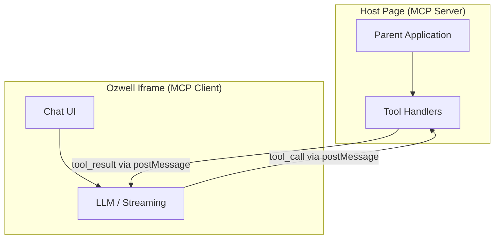
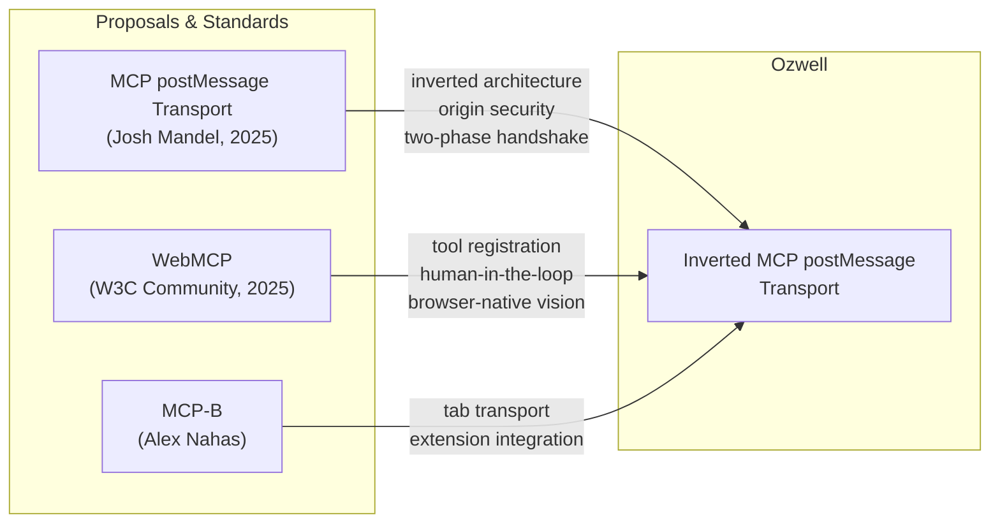

# MCP postMessage Standard

Ozwell's frontend integration is built on an **inverted MCP postMessage transport** — an architecture where an embedded AI assistant (inside an iframe) calls tools provided by the host page. This page documents the proposals and community work that inspired this design.

## Background: MCP Transports

The [Model Context Protocol (MCP)](https://modelcontextprotocol.io/introduction) defines how AI applications communicate with tool-providing servers. At launch, MCP shipped with two transports:

- **stdio** — for local, same-machine communication
- **Streamable HTTP** (formerly SSE) — for remote server communication

Both require the MCP server to run as a separate process or remote service. Neither addresses a common web scenario: **an AI assistant embedded directly in a web page** that needs to call tools owned by the host application.

## The postMessage Transport Proposal

In July 2025, [Josh Mandel](https://github.com/jmandel) proposed a third transport for MCP: a **postMessage transport** that enables MCP communication between browser contexts (iframes and popup windows) using the browser's [`window.postMessage`](https://developer.mozilla.org/en-US/docs/Web/API/Window/postMessage) API.

- **Proposal:** [SEP: postMessage Transport for MCP #1005](https://github.com/modelcontextprotocol/modelcontextprotocol/issues/1005)
- **Reference Implementation:** [Demo](https://jmandel.github.io/mcp-postmessage) | [Source](https://github.com/jmandel/mcp-postmessage)

### Key Ideas from the Proposal

The postMessage transport introduced several concepts that directly influenced Ozwell's architecture:

#### Two Supported Architectures

The proposal separates the **window hierarchy** (which frame is parent vs. child) from the **MCP protocol roles** (which side is client vs. server):

| | Standard Architecture | Inverted Architecture |
|---|---|---|
| **Outer Frame Role** | MCP Client | MCP Server |
| **Inner Frame Role** | MCP Server | MCP Client |
| **Who provides tools?** | Inner Frame | Outer Frame |
| **Who calls tools?** | Outer Frame | Inner Frame |

The **Standard Architecture** is for apps that embed third-party MCP services as iframes — the parent page consumes tools from the embedded frame.

The **Inverted Architecture** is the pattern Ozwell uses — the parent page provides tools to an embedded AI assistant.

#### Privacy-First Processing

From the proposal:

> Browser-local execution ensures sensitive data can stay on the user's device, enabling new classes of privacy-preserving AI tools.

This aligns directly with Ozwell's core principle: conversations are private by default, and the host page never sees message content.

#### Zero-Installation Distribution

MCP servers distributed as URLs eliminate installation friction. Users don't need to install software or run processes — the capability is delivered via a web page loaded in an iframe.

#### Origin-Based Security

The transport relies on the browser's built-in `event.origin` validation rather than custom authentication schemes, providing tamper-proof message delivery between frames.

### Proposal Status

The postMessage transport SEP was marked **dormant** in November 2025 after not finding a sponsor among MCP maintainers. The maintainer noted:

> I want to keep the amount of transports small and for a very general usecase... I think this should either live as a separate, externally maintained extension to MCP or as community project with appropriate SDKs.

The proposal and its reference implementation remain available as community resources.

## WebMCP (W3C Web Machine Learning)

The MCP maintainers also pointed to [WebMCP](https://github.com/webmachinelearning/webmcp) — a W3C community proposal for a browser-native JavaScript API that lets web pages expose their functionality as tools to AI agents and assistive technologies.

- **Repository:** [webmachinelearning/webmcp](https://github.com/webmachinelearning/webmcp)
- **Spec:** [webmachinelearning.github.io/webmcp](https://webmachinelearning.github.io/webmcp/)

### How WebMCP Differs

Where the postMessage transport proposal defines an *MCP wire protocol over postMessage*, WebMCP proposes a **browser-native JavaScript API** for tool registration:

```javascript
// WebMCP: page registers tools via browser API
navigator.ai.registerTool({
  name: "get_weather",
  description: "Get current weather for a location",
  parameters: { location: { type: "string" } },
  handler: async ({ location }) => {
    return await fetchWeather(location);
  }
});
```

WebMCP is designed for a future where browsers have built-in AI agents that can discover and invoke tools declared by web pages. It focuses on:

- **Human-in-the-loop workflows** — users and agents collaborate on the same page
- **Accessibility** — tools provide structured actions beyond what the DOM/accessibility tree offers
- **Code reuse** — web developers reuse existing frontend JavaScript as tool implementations

### Related: MCP-B

[MCP-B](https://github.com/MiguelsPizza/WebMCP) (also called WebMCP) is a community project that extends MCP with browser tab transports, enabling in-page communication between a website's MCP server and clients in the same tab or browser extension. A contributor to MCP-B, [Alex Nahas](https://github.com/MiguelsPizza), noted in the postMessage transport discussion that MCP-B and the postMessage transport together "solve many of the issues with remote MCP servers."

## Ozwell's Approach: Inverted MCP postMessage

Ozwell synthesizes ideas from both proposals into a production-ready embeddable system.



### How It Works

1. The **host page** embeds the Ozwell chat widget in an iframe
2. The **Ozwell iframe** handles the LLM conversation (streaming, message history, UI)
3. When the LLM responds with a `tool_call`, the iframe sends it to the parent via `postMessage`
4. The **parent page** executes the tool using its own application context, session, and APIs
5. The parent sends the `tool_result` back to the iframe via `postMessage`
6. The iframe feeds the result back to the LLM to complete the response

This is the **inverted architecture** from Josh Mandel's proposal: the MCP client (tool caller) is inside the iframe, and the MCP server (tool provider) is the parent page.

### Why Inverted?

The inverted pattern is ideal for embeddable AI assistants because:

- **The host page owns the tools.** The parent already has the user's session, application state, and access to private APIs. No credential sharing needed.
- **The AI is sandboxed.** The LLM and chat UI run in an isolated iframe with no access to the parent DOM, cookies, or JavaScript context.
- **Privacy by default.** Conversation content stays inside the iframe. The parent only sees lifecycle events and explicit tool call/result messages — never the user's chat messages.
- **Pluggable across sites.** The same Ozwell widget can be embedded anywhere; each host site supplies its own tools.

### Ozwell's Additions

Beyond the core postMessage transport concepts, Ozwell adds:

- **Privacy-first event model** — No `onMessage` or content events. Only lifecycle events (`ozwell:ready`, `ozwell:open`, `ozwell:close`) and opt-in sharing (`ozwell:user-share`).
- **Scoped API keys** — Frontend-safe keys tied to specific agents and permissions.
- **SSE streaming** — The iframe streams LLM completions via Server-Sent Events, independent of the postMessage tool channel.
- **Message queuing** — Users can queue messages while the AI is responding, enabling fluid interactions (especially useful for interactive demos like games).

For implementation details, see the [Iframe Integration](./iframe-integration.md) guide and the [Embed README](https://github.com/mieweb/ozwellai-api/tree/main/reference-server/embed).

## Relationship Summary



## Further Reading

- [SEP: postMessage Transport for MCP #1005](https://github.com/modelcontextprotocol/modelcontextprotocol/issues/1005) — The original proposal by Josh Mandel
- [jmandel/mcp-postmessage](https://github.com/jmandel/mcp-postmessage) — Reference implementation with demos for both standard and inverted architectures
- [webmachinelearning/webmcp](https://github.com/webmachinelearning/webmcp) — W3C community proposal for browser-native AI tool APIs
- [MCP-B / WebMCP](https://github.com/MiguelsPizza/WebMCP) — Browser extension transport for MCP
- [Iframe Integration](./iframe-integration.md) — Ozwell's implementation of the inverted postMessage pattern
- [Embed Widget](https://github.com/mieweb/ozwellai-api/tree/main/reference-server/embed) — Source code for Ozwell's postMessage-based embed system
