# Frontend Integration Overview

This guide covers how to integrate Ozwell's AI chat interface into your website or web application. All frontend integrations use **scoped API keys** that are restricted to specific agents and their assigned permissions, making them safe for client-side use.

> **Try it live:** See Ozwell in action at the [demo site](https://ozwellai-embedtest.opensource.mieweb.org/).

## Integration Approaches

```mermaid
graph LR
    subgraph Options[" "]
        A[Your Website] --> B{Integration Method}
        B --> C[🚀 CDN Embed]
        B --> D[📦 Framework]
        B --> E[🖼️ Direct Iframe]
        
        C --> C1[Single script tag<br/>Zero build step]
        D --> D1[React / Vue / Svelte<br/>Full control]
        E --> E1[Manual iframe<br/>Custom implementation]
    end
```



## Quick Comparison

| Method | Setup Time | Build Required | Best For |
|--------|------------|----------------|----------|
| [CDN Embed](./cdn-embed.md) | ~5 min | No | Static sites, quick prototypes |
| [Framework](#framework-integration) | ~15 min | Yes | Production SPAs |
| [Iframe](./iframe-integration.md) | ~10 min | Optional | Custom implementations |

---

## CDN Embed (Fastest)

Add Ozwell to any website with a single script tag. No build step required.

```html
<script 
  src="https://cdn.ozwell.ai/embed.js" 
  data-api-key="your-scoped-api-key"
  data-agent-id="your-agent-id"
></script>
```

➡️ [Full CDN documentation](./cdn-embed.md)

---

## Framework Integration

For production applications using modern JavaScript frameworks, we provide dedicated integration guides:

| Framework | Guide | Status |
|-----------|-------|--------|
| React | [React Integration](./react.md) | ✅ |
| Next.js | [Next.js Integration](./nextjs.md) | ✅ |
| Vue 3 | [Vue 3 Integration](./vue3.md) | ✅ |
| Vue 2 | [Vue 2 Integration](./vue2.md) | ✅ |
| Svelte | [Svelte Integration](./svelte.md) | ✅ |
| Vanilla JS | [Vanilla JS Integration](./vanilla.md) | ✅ |

All framework integrations render Ozwell within an **isolated iframe**, ensuring:
- 🔒 **Security isolation** from your host page
- 🎨 **Consistent styling** that won't conflict with your CSS
- 📱 **Responsive behavior** out of the box

---

## Security Model

### Privacy First

Ozwell is built on a foundation of **user privacy and control**. When a user opens Ozwell, their conversation is private—the host site cannot see, intercept, or log what is said. This creates a safe space where users can:

- Ask any question without embarrassment
- Explore topics freely without surveillance  
- Trust that their dialogue stays between them and Ozwell

**Sharing is always opt-in.** Only when a user explicitly chooses to share information does it become visible to the host site.

### Scoped API Keys

Frontend integrations use **scoped API keys** which are:

- ✅ **Agent-specific:** Tied to a single agent configuration
- ✅ **Permission-limited:** Only allows operations the agent is authorized for
- ✅ **Rate-limited:** Protected against abuse
- ✅ **Revocable:** Can be rotated or disabled without affecting other keys


### Iframe Isolation

All frontend integrations run inside an iframe with:

- **Sandboxed execution** — No access to parent page DOM
- **Origin isolation** — Separate security context
- **CSP compliance** — Strict content security policies
- **No message relay** — Conversation content stays in the iframe
- **User-controlled sharing** — Only explicit user actions can share data

➡️ [Learn more about iframe security](./iframe-integration.md)

---

## Customization Options

### Appearance

| Option | Description | Default |
|--------|-------------|---------|
| `theme` | Light or dark mode | `auto` |
| `primaryColor` | Accent color for buttons/links | `#4f46e5` |
| `position` | Widget position (bottom-right, bottom-left, etc.) | `bottom-right` |
| `width` | Chat window width | `400px` |
| `height` | Chat window height | `600px` |

### Behavior

| Option | Description | Default |
|--------|-------------|---------|
| `autoOpen` | Open chat on page load | `false` |
| `greeting` | Initial message to display | Agent's default |
| `placeholder` | Input field placeholder text | `"Type a message..."` |

---

## Privacy by Design

**The conversation between Ozwell and the user is private by default.**

```mermaid
graph TB
    subgraph "Privacy Model"
        User[👤 User] <-->|Private Conversation| Ozwell[🤖 Ozwell]
        Site[🌐 Host Site] -.->|Cannot Inspect| Ozwell
        
        User -->|Explicit Consent| Share[📤 Share with Site]
        Share --> Site
    end
```



### Why Privacy Matters

- **No message relay:** Conversation content is never sent to the host site
- **Safe space:** Users can ask any question without fear of judgment or surveillance
- **User control:** Only the user decides if and when to share conversation details
- **Trust:** The Ozwell brand stands for privacy and user empowerment

### What the Host Site Can See

The host site receives **only lifecycle events**, never message content:

```javascript
// ✅ Allowed: Lifecycle events (no content)
window.addEventListener('ozwell:ready', () => {
  console.log('Ozwell widget loaded');
});

window.addEventListener('ozwell:open', () => {
  console.log('Chat opened');
});

window.addEventListener('ozwell:close', () => {
  console.log('Chat closed');
});

// ❌ Not available: Message content is private
// window.addEventListener('ozwell:message', ...) — Does not exist
```

### User-Initiated Sharing

If the user explicitly chooses to share information with the host site, they can do so through in-chat actions:

```javascript
// Only triggered when user clicks "Share with site" in chat
window.addEventListener('ozwell:user-share', (event) => {
  // User explicitly consented to share this specific data
  console.log('User shared:', event.detail);
});
```

This ensures users always feel comfortable asking questions—even ones they might consider "dumb"—knowing the conversation stays between them and Ozwell.

---

## Next Steps

1. **Quick start:** Try the [CDN embed](./cdn-embed.md) first
2. **Production app:** Follow your framework guide above
3. **Custom needs:** Review [iframe integration](./iframe-integration.md)
4. **Security deep-dive:** Understand the [iframe security model](./iframe-integration.md#security)
