# Ozwell Documentation

Welcome to the Ozwell API documentation. This guide will help you integrate Ozwell's AI capabilities into your applications, whether you're embedding a chat interface into your website or building custom backend workflows.

## Privacy First

**Ozwell is built on a foundation of user privacy and trust.**

When users interact with Ozwell, their conversation is private by default. Host sites cannot see, intercept, or log what is said—this creates a safe space where users feel comfortable asking any question. Sharing is always opt-in: only when a user explicitly chooses to share information does it become visible to the host site.

## Integration Paths

Ozwell offers two primary integration approaches, each designed for different use cases and security requirements:

```mermaid
graph TB
    subgraph "🎯 Choose Your Integration Path"
        Start[Start Here] --> Q1{What are you building?}
        
        Q1 -->|Website/App UI| Frontend[📱 Frontend Integration]
        Q1 -->|Custom Backend/API| Backend[⚙️ Backend Integration]
        
        Frontend --> F1[CDN Embed]
        Frontend --> F2[Framework Integration]
        
        F1 --> F1Desc[Quick script tag<br/>No build step required]
        F2 --> F2Desc[React, Vue, Svelte, etc.<br/>Iframe isolation]
        
        Backend --> B1[API Reference]
        B1 --> B1Desc[Full API access<br/>Custom workflows]
    end
```

## Frontend Integration

**Best for:** Adding an AI chat interface to your website or web application.

Frontend integrations use **scoped API keys** that are restricted to specific agents and their assigned permissions. This allows you to safely embed Ozwell in client-facing applications.

### Options:

| Approach | Best For | Setup Time |
|----------|----------|------------|
| [CDN Embed](./frontend/cdn-embed.md) | Quick prototypes, static sites | ~5 minutes |
| [Framework Integration](./frontend/overview.md) | Production apps, SPAs | ~15 minutes |

**Key Features:**
- 🔐 **Privacy by default** — Conversations stay between user and Ozwell
- 🔒 Iframe isolation for security
- 🎨 Customizable styling
- 📱 Responsive design
- 🔑 Scoped API keys with limited permissions

➡️ [Get started with Frontend Integration](./frontend/overview.md)

---

## Backend Integration

**Best for:** Custom workflows, server-side processing, and programmatic AI interactions.

Backend integrations use **general-purpose API keys** with broader access to Ozwell's capabilities. These keys should be kept secure on your server.

### Capabilities:

- Chat completions and conversations
- File uploads and management
- Embeddings generation
- Model management
- Custom agent configurations

**Key Features:**
- 🔐 Full API access
- 🛠️ Flexible integration patterns
- 📊 Detailed response control
- 🔄 Streaming support

➡️ [Get started with Backend Integration](./backend/overview.md)

---

## Quick Comparison

| Feature | Frontend (CDN/Framework) | Backend (API) |
|---------|--------------------------|---------------|
| **Privacy Model** | Conversations private by default | Server-controlled |
| **API Key Type** | Scoped (agent-specific) | General-purpose |
| **Security Model** | Client-safe, restricted | Server-side, full access |
| **Use Case** | User-facing chat UI | Custom workflows |
| **Setup Complexity** | Low | Medium |
| **Customization** | UI styling, agent selection | Full programmatic control |

---

## Next Steps

1. **New to Ozwell?** Start with the [CDN integration](./frontend/cdn-embed.md) for the fastest path to a working demo.

2. **Building a production app?** Check the [Framework guides](./frontend/overview.md) for React, Vue, Svelte, and more.

3. **Need programmatic access?** Dive into the [Backend API reference](./backend/api-endpoints.md).

---

## Additional Resources

- [Contributing Guide](./CONTRIBUTING.md) — How to contribute to these docs
- [API Reference](./backend/api-endpoints.md) — Complete endpoint documentation
- [Examples](./backend/api-examples.md) — Code samples and recipes

---

## Getting Help

- **GitHub Issues:** Report bugs or request features
- **Discussions:** Ask questions and share ideas
- **API Status:** Check service availability
