# Ozwell Documentation

Welcome to the Ozwell API documentation. This guide will help you integrate Ozwell's AI capabilities into your applications, whether you're embedding a chat interface into your website or building custom backend workflows.

## Privacy First

**Ozwell is built on a foundation of user privacy and trust.**

When users interact with Ozwell, their conversation is private by default. Host sites cannot see, intercept, or log what is said—this creates a safe space where users feel comfortable asking any question. Sharing is always opt-in: only when a user explicitly chooses to share information does it become visible to the host site.

## Integration Paths

Ozwell offers two primary integration approaches, each designed for different use cases and security requirements.

### Understanding Frontend vs Backend

There are three main ways to integrate Ozwell:

#### Option 1: Ozwell's Frontend → Ozwell's API (Quickest)
**Use Ozwell's pre-built chat widget** - embedded directly in your site
- Users interact with Ozwell's interface in an iframe
- The widget talks directly to Ozwell's API (not through your server)
- You just add a script tag - everything else is handled
- **Example:** Marketing site with a "Chat with AI" button
- **Security:** Uses scoped API keys (safe in browser)

#### Option 2: Your Frontend → Your Backend → Ozwell's API (Most Control)
**Build your own custom chat interface** that your users interact with
- You design the chat UI yourself (React, Vue, etc.)
- Your frontend talks to YOUR backend API
- Your backend then makes calls to Ozwell's API
- **Example:** Custom chatbot interface integrated into your app's design
- **Security:** Your backend keeps Ozwell API key secret
- **Why do this?** Full control over UX, add custom logic, integrate with your database

⚠️ **Important - Branding & Transparency:**
When you build your own chat interface powered by Ozwell's API, you **must NOT** brand it as "Ozwell" or imply that users are talking directly to Ozwell. Users need to understand:
- They're interacting with **YOUR application**
- The conversation is happening within **YOUR system** (not Ozwell's private environment)
- Data may be stored/processed by **YOUR application** (different privacy model than Ozwell's widget)

**Trademark Notice:**
"Ozwell" is a trademark of Medical Informatics Engineering. Use of the Ozwell name and branding must comply with our privacy-first principles. We actively monitor and enforce proper trademark usage to protect user trust and privacy expectations.

**Good examples:**
- "Chat with [Your App Name] Assistant"
- "Ask [Your Product] AI"
- "Powered by AI" (with your branding)
- "AI-powered by Ozwell" (in footer/about, clearly indicating underlying technology)

**Not acceptable:**
- "Chat with Ozwell" (misleading - they're chatting with your app)
- Ozwell logo/branding as primary interface branding
- Implying the conversation is private to Ozwell when it goes through your servers
- Any use that creates confusion about whether users are in Ozwell's environment or yours

#### Option 3: Your Backend → Ozwell's API (No UI)
**Server-side automation** with no user-facing chat interface
- No chat widget at all - pure backend processing
- Your server makes API calls to Ozwell programmatically
- **Example:** Automated document processing, email summarization, data analysis
- **Security:** API keys stay on your server

```mermaid
graph TB
    subgraph "Option 1: Ozwell's Widget (Fastest)"
        User1[👤 User] -->|Types| Widget[💬 Ozwell Widget]
        Widget -->|iframe on| Site1[🌐 Your Site]
        Widget -.->|Direct| OzwellAPI1[☁️ Ozwell API]
        style Widget fill:#e3f2fd
        style OzwellAPI1 fill:#e3f2fd
    end
    
    subgraph "Option 2: Custom UI + Your Backend (Most Flexible)"
        User2[👤 User] -->|Types| CustomUI[🎨 Your Custom UI]
        CustomUI -->|in| Site2[🌐 Your Site]
        CustomUI -->|Calls| YourBackend[🖥️ Your Backend API]
        YourBackend -->|Proxies to| OzwellAPI2[☁️ Ozwell API]
        style CustomUI fill:#fff9c4
        style YourBackend fill:#fff9c4
        style OzwellAPI2 fill:#e3f2fd
    end
    
    subgraph "Option 3: Backend Only (Automation)"
        YourServer[⚙️ Your Server] -->|Automated| OzwellAPI3[☁️ Ozwell API]
        OzwellAPI3 -.->|Results| YourServer
        style YourServer fill:#fff3e0
        style OzwellAPI3 fill:#e3f2fd
    end
```



### Which Option Should You Choose?

```mermaid
graph TB
    Start[🎯 Choose Your Integration] --> Q1{Do you want to show<br/>a chat interface to users?}
    
    Q1 -->|No, backend only| Backend[Option 3: Backend API Only]
    Q1 -->|Yes| Q2{Who builds the<br/>chat interface?}
    
    Q2 -->|"Ozwell (ready-made)"| Q3{How are you<br/>building your site?}
    Q2 -->|"Me (custom design)"| Custom[Option 2: Your Frontend + Backend]
    
    Q3 -->|"Simple HTML site"| CDN[Option 1: CDN Embed]
    Q3 -->|"React/Vue/Svelte app"| Framework[Option 1: Framework Integration]
    
    Backend --> B1[⚙️ Server-side automation<br/>📄 Document processing<br/>🤖 Custom workflows<br/>⏱️ Setup: 30+ min]
    
    Custom --> C1[🎨 Full UI control<br/>🔐 Keep API keys secret<br/>💾 Integrate with your DB<br/>⏱️ Setup: 1-2 hours]
    
    CDN --> F1[✨ Fastest: 5 minutes<br/>📜 One script tag<br/>🎯 Perfect for demos]
    
    Framework --> F2[🚀 Production ready<br/>🎨 Matches your app<br/>⏱️ Setup: 15 minutes]
    
    style Backend fill:#fff3e0
    style Custom fill:#fff9c4
    style CDN fill:#e3f2fd
    style Framework fill:#e3f2fd
```



### Real-World Scenarios

**Scenario A: Marketing Website**
> "I want to add AI chat to my marketing site for customer support"

→ **Use Option 1 (CDN Embed)** - Quick, no backend needed

**Scenario B: SaaS Application**
> "I'm building a custom app and want AI chat that matches my design and integrates with my user accounts"

→ **Use Option 2 (Your Frontend + Backend)** - Full control, custom UX

⚠️ **Important:** Brand it as YOUR application's assistant. Users must understand they're talking to your app (which uses Ozwell's AI behind the scenes), not directly to Ozwell. This affects their privacy expectations - data flows through YOUR system.

**Scenario C: Document Processing Service**
> "I need to automatically analyze uploaded documents and extract information"

→ **Use Option 3 (Backend API Only)** - No UI needed, pure automation

---

## Frontend Integration (Option 1)

Use Ozwell's **pre-built chat widget** for the fastest path to a working AI chat interface.

**Best for:** Adding an AI chat interface to your website or web application.

Frontend integrations use **scoped API keys** that are restricted to specific agents and their assigned permissions. This allows you to safely embed Ozwell in client-facing applications.

**Note:** If you want to build your own custom chat interface, see **Option 2** in the comparison table below - you'll use the Backend API with your custom frontend.

### Options:

| Approach | Best For | Setup Time |
|----------|----------|------------|
| [CDN Embed](./frontend/cdn-embed.md) | Quick prototypes, static sites | ~5 minutes |
| [Framework Integration](./frontend/overview.md) | Production apps, SPAs | ~15 minutes |

**Key Features:**
- 🔐 **Privacy by default** — Conversations stay between user and Ozwell
- 🔒 Iframe isolation for security
- 🎨 Customizable styling
- 📱 Responsive design
- 🔑 Scoped API keys with limited permissions

➡️ [Get started with Frontend Integration](./frontend/overview.md)

---

## Backend Integration (Option 3)

**Best for:** Custom workflows, server-side processing, and programmatic AI interactions.

Backend integrations use **general-purpose API keys** with broader access to Ozwell's capabilities. These keys should be kept secure on your server.

**Note:** If you're building a custom chat UI for users, you'll use this Backend API but you're implementing **Option 2** (Your Frontend + Your Backend + Ozwell API).

### Capabilities:

- Chat completions and conversations
- File uploads and management
- Embeddings generation
- Model management
- Custom agent configurations

**Key Features:**
- 🔐 Full API access
- 🛠️ Flexible integration patterns
- 📊 Detailed response control
- 🔄 Streaming support

➡️ [Get started with Backend Integration](./backend/overview.md)

---

## Quick Comparison: All Integration Options

### At a Glance

| Aspect | Option 1:<br/>Ozwell Widget | Option 2:<br/>Custom Frontend + Backend | Option 3:<br/>Backend Only |
|---------|--------------------------|---------------|-------------|
| **What It Does** | Adds Ozwell's chat widget | You build custom UI + backend proxy | Server automation |
| **Who Sees It** | ✅ Users see Ozwell's UI | ✅ Users see YOUR custom UI | ❌ No user interface |
| **Architecture** | Browser → Ozwell | Browser → Your Server → Ozwell | Your Server → Ozwell |
| **Branding** | ✅ "Chat with Ozwell" | ⚠️ Must use YOUR branding | N/A (no UI) |
| **User Understanding** | Users know they're talking to Ozwell | Users must know they're talking to YOUR app | N/A (no UI) |
| **Privacy Context** | Ozwell's private environment | Your application's environment | Your server |
| **Setup Time** | ⭐ 5-15 minutes | ⭐⭐⭐ 1-2 hours | ⭐⭐ 30+ minutes |
| **API Key Location** | In browser (scoped key) | On your server (general key) | On your server (general key) |
| **API Key Type** | Scoped (safe in browser) | General-purpose (secret) | General-purpose (secret) |
| **Customization** | Widget styling & config | Full control over everything | Full programmatic control |
| **Best For** | • Quick demos<br/>• Marketing sites<br/>• Simple support chat | • SaaS products<br/>• Custom UX<br/>• Database integration<br/>• Multi-tenancy | • Document processing<br/>• Automation<br/>• Background tasks<br/>• No UI needed |
| **Privacy Model** | Conversations private by default | You control all data flow | Server-controlled |

### Code Examples

**Option 1: Ozwell Widget (Fastest)**
```html
<!-- Add this to your HTML, and you're done! -->
<script 
  src="https://cdn.ozwell.ai/embed.js" 
  data-api-key="ozw_scoped_..."
  data-agent-id="agent_123"
></script>
```
✅ Result: Ozwell's chat button appears. Users click and chat.

**Option 2: Custom Frontend + Your Backend**
```javascript
// Your React component
function CustomChat() {
  const sendMessage = async (message) => {
    // Call YOUR backend
    const response = await fetch('/api/chat', {
      method: 'POST',
      body: JSON.stringify({ message }),
      headers: { 'Authorization': `Bearer ${userToken}` }
    });
    return response.json();
  };
  
  // IMPORTANT: Brand this as YOUR app, not "Ozwell"
  // Example: "Chat with Acme Assistant" or "Ask Acme AI"
  return <YourCustomChatUI 
    title="Chat with Acme Assistant"
    onSend={sendMessage} 
  />;
}

// Your backend (Node.js)
app.post('/api/chat', async (req, res) => {
  // Your backend calls Ozwell
  const client = new OzwellClient({ 
    apiKey: process.env.OZWELL_API_KEY  // Secret!
  });
  
  const result = await client.chat.completions.create({
    model: 'gpt-4',
    messages: [{ role: 'user', content: req.body.message }]
  });
  
  // You can add custom logic here
  await db.saveMessage(req.user.id, result);
  
  res.json(result);
});
```
✅ Result: Full control over UI, can integrate with your auth, database, business logic.
⚠️ **Remember:** Users see YOUR branding and understand they're in YOUR app.

**Option 3: Backend Only (Automation)**
```javascript
// Your Node.js server - no frontend UI
const client = new OzwellClient({ apiKey: process.env.OZWELL_API_KEY });

// Automated processing
async function processDocument(documentPath) {
  const summary = await client.chat.completions.create({
    model: 'gpt-4',
    messages: [{ 
      role: 'user', 
      content: 'Summarize this document...' 
    }]
  });
  
  await database.save(summary);
  return summary;
}
```
✅ Result: Your server can process documents, analyze data, etc. No chat UI.

---

## Trademark & Branding Policy

**"Ozwell" is a trademark of Medical Informatics Engineering.**

We take our privacy-first brand promise seriously and actively monitor the use of the Ozwell trademark to ensure it aligns with our core values of user privacy and trust.

### Trademark Usage Guidelines

#### ✅ Permitted Uses:

1. **Attribution (Option 1 - Ozwell Widget):**
   - When using Ozwell's official widget, users should see "Ozwell" branding
   - Users understand they're in Ozwell's private environment
   - Conversations remain private by default

2. **Technology Attribution:**
   - "Powered by Ozwell" in footer or about pages
   - "Built with Ozwell API" in technical documentation
   - Clearly indicates underlying technology, not the primary user interface

3. **Factual References:**
   - "This application uses Ozwell's API for AI capabilities"
   - Technical blog posts, case studies, integration tutorials

#### ❌ Prohibited Uses:

1. **Misleading Primary Branding (Option 2 - Custom Implementations):**
   - ❌ "Chat with Ozwell" when users are actually chatting with YOUR application
   - ❌ Ozwell logo as the primary interface branding for custom implementations
   - ❌ Any use that implies users are in Ozwell's private environment when they're not
   - ❌ Creating confusion about data privacy (whose servers, whose privacy policy applies)

2. **Trademark Violations:**
   - ❌ Using "Ozwell" in your product name without permission
   - ❌ Modifying the Ozwell logo or branding
   - ❌ Implying endorsement or partnership without agreement

### Why This Matters: Privacy & Trust

When users see "Ozwell," they expect:
- **Privacy by default** — Conversations that stay between them and Ozwell
- **No surveillance** — Host sites cannot see their messages
- **User control** — Sharing is always opt-in

If you build a custom interface (Option 2) and brand it as "Ozwell," users will have false privacy expectations. In reality:
- Conversations go through YOUR servers
- YOU can log, store, and process messages
- YOUR privacy policy applies, not Ozwell's

**This is why proper branding is mandatory, not optional.** We enforce our trademark to protect users' right to informed consent about their privacy.

### Enforcement

Medical Informatics Engineering reserves the right to:
- Request changes to implementations that misuse the Ozwell trademark
- Revoke API access for violations of trademark policy
- Take legal action for serious violations that harm user trust

### Questions?

If you're unsure whether your use case complies with our trademark policy, please contact us before launching. We're here to help you use Ozwell properly while maintaining user trust.

---

## Next Steps

1. **New to Ozwell?** Start with the [CDN integration](./frontend/cdn-embed.md) for the fastest path to a working demo.

2. **Building a production app?** Check the [Framework guides](./frontend/overview.md) for React, Vue, Svelte, and more.

3. **Need programmatic access?** Dive into the [Backend API reference](./backend/api-endpoints.md).

---

## Additional Resources

- [Contributing Guide](./CONTRIBUTING.md) — How to contribute to these docs
- [API Reference](./backend/api-endpoints.md) — Complete endpoint documentation
- [Examples](./backend/api-examples.md) — Code samples and recipes

---

## Getting Help

- **GitHub Issues:** Report bugs or request features
- **Discussions:** Ask questions and share ideas
- **API Status:** Check service availability
