# Ozwell Documentation

Welcome to the Ozwell API documentation. Ozwell is a privacy-first AI platform that makes it easy to add intelligent conversational interfaces to your applications.

## What is Ozwell?

**Ozwell is an AI integration platform that puts user privacy first.**

Built by Medical Informatics Engineering, Ozwell provides AI-powered chat capabilities that you can embed in your applications while maintaining strong privacy guarantees for your users. Whether you need a ready-made chat widget or full programmatic API access, Ozwell gives you the tools to add AI to your products.

### Core Principles

1. **Privacy by Default**
   - User conversations are private by default
   - Host sites cannot intercept or log messages
   - Creates a safe space for users to ask any question

2. **User Control**
   - Sharing is always opt-in
   - Users explicitly choose what to share with host sites
   - Transparent data handling

3. **Developer-Friendly**
   - Multiple integration options (widget, API, custom)
   - OpenAI-compatible API
   - Strong type safety and documentation

---

## What is the Ozwell API?

The **Ozwell API** (`ozwellai-api`) is the technical interface for integrating Ozwell into your applications. It provides:

- **Chat Completions** - Generate AI responses for conversations
- **File Management** - Upload and process documents
- **Embeddings** - Create vector representations for semantic search
- **Agent Management** - Configure and customize AI behavior

The API is designed to be familiar to developers who have used OpenAI's API, with extensions for multi-user scenarios and advanced conversation management.

```javascript
// Example: Basic chat completion
import { OzwellClient } from '@ozwell/api';

const client = new OzwellClient({ apiKey: process.env.OZWELL_API_KEY });

const response = await client.chat.completions.create({
  model: 'gpt-4',
  messages: [
    { role: 'user', content: 'What is Ozwell?' }
  ]
});

console.log(response.choices[0].message.content);
```

---

## What are Ozwell Agents?

**Agents** are pre-configured AI assistants with specific knowledge, capabilities, and behavior patterns.

### Agent Features

- **Scoped Knowledge** - Agents can have access to specific documents and data
- **Custom Instructions** - Define how the agent responds and behaves
- **Tool Access** - Grant agents specific capabilities (file upload, search, etc.)
- **Model Selection** - Choose which AI models the agent can use
- **Access Control** - Define who can interact with each agent

### Example Use Cases

| Agent Type | Description | Use Case |
|------------|-------------|----------|
| **Support Agent** | Customer service focused | Help desk, FAQs, troubleshooting |
| **Product Guide** | Product-specific knowledge | Onboarding, feature discovery |
| **Document Assistant** | File processing capabilities | Analyze contracts, summarize reports |
| **Code Helper** | Programming knowledge | Code review, debugging assistance |

### Agent API Keys

Agents use **scoped API keys** that are restricted to:
- The specific agent's configuration
- The agent's allowed models
- The agent's accessible files and tools
- Rate limits specific to that agent

This makes agent keys safe to use in client-side applications (like embedded widgets), unlike general-purpose API keys which must be kept server-side.

```mermaid
graph TB
    subgraph "Agent Architecture"
        User[👤 User] -->|Interacts with| Widget[💬 Chat Widget]
        Widget -->|Uses Scoped Key| Agent[🤖 Configured Agent]
        Agent -->|Has Access To| Knowledge[📚 Knowledge Base]
        Agent -->|Can Use| Models[🧠 AI Models]
        Agent -->|Limited By| Permissions[🔐 Permissions]
        
        style Agent fill:#e3f2fd
        style Widget fill:#e3f2fd
        style Permissions fill:#ffebee
    end
```



---

## Privacy First: Why It Matters

**Ozwell is built on a foundation of user privacy and trust.**

When users interact with Ozwell's widget, their conversation is private by default. Host sites cannot see, intercept, or log what is said—this creates a safe space where users feel comfortable asking any question. Sharing is always opt-in: only when a user explicitly chooses to share information does it become visible to the host site.

### Privacy Models by Integration Type

Different integration approaches have different privacy characteristics:

| Integration | Privacy Model | Who Can See Messages |
|-------------|---------------|---------------------|
| **Ozwell Widget** | Private by default | Only Ozwell (and user via opt-in sharing) |
| **Custom UI + Your Backend** | Your control | Your application (you're responsible) |
| **Backend API Only** | Server-controlled | Your server application |

It's critical that users understand which environment they're in, which is why we have strict [trademark and branding policies](./integration-paths.md#trademark--branding-policy) for custom implementations.

---

## How to Get Started

Ready to integrate Ozwell? Choose your path:

### 🎯 [Choose Your Integration Path](./integration-paths.md)

Not sure which approach is right for you? Our integration paths guide will help you choose between:
- **Option 1**: Ozwell's pre-built widget (fastest, 5-15 minutes)
- **Option 2**: Custom UI with your backend (full control, 1-2 hours)  
- **Option 3**: Backend API only (automation, 30+ minutes)

### 📱 [Frontend Integration](./frontend/overview.md)

Add Ozwell's chat widget to your website:
- CDN embed (single script tag)
- Framework integrations (React, Vue, Svelte, Next.js)
- Scoped API keys (safe for client-side use)
- Privacy-first by design

### ⚙️ [Backend Integration](./backend/overview.md)

Programmatic API access for custom workflows:
- Chat completions and conversations
- File management and processing
- Embeddings for semantic search
- Full programmatic control

---

## API Reference

Detailed technical documentation:

- **[API Overview](./backend/api-overview.md)** - Core concepts and patterns
- **[Authentication](./backend/api-authentication.md)** - API keys and security
- **[Endpoints](./backend/api-endpoints.md)** - Complete API reference
- **[Examples](./backend/api-examples.md)** - Code samples and recipes

---

## SDK Documentation

Pre-built client libraries for popular languages:

- **[TypeScript SDK](./backend/sdk-typescript.md)** - For Node.js and browser
- **[Deno SDK](./backend/sdk-deno.md)** - For Deno runtime
- **[Python SDK](./backend/sdk-python.md)** - For Python applications

---

## Additional Resources

- **[Contributing Guide](./CONTRIBUTING.md)** — How to contribute to these docs
- **[Integration Paths Guide](./integration-paths.md)** — Detailed comparison of all integration options
- **[Trademark Policy](./integration-paths.md#trademark--branding-policy)** — Usage guidelines

---

## Getting Help

- **GitHub Issues:** Report bugs or request features
- **Discussions:** Ask questions and share ideas
- **API Status:** Check service availability
