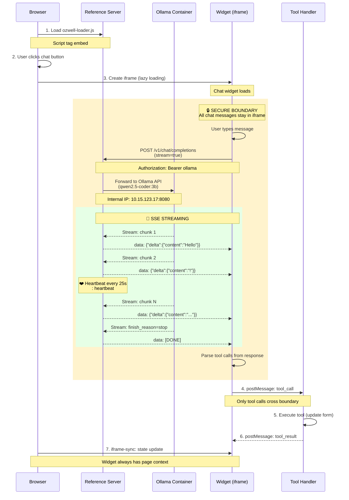

# OzwellAI Reference Server

An OpenAI-compatible Fastify server that provides a reference implementation of the OzwellAI API. This server mimics the OpenAI REST API, allowing existing OpenAI SDKs and clients to work by only changing the `base_url` and `api_key`.

## Features

- **Full OpenAI API Compatibility**: Wire-compatible with OpenAI's API specification
- **Real Text Inference**: Uses deterministic text generation for predictable testing
- **MCP Host**: Built-in WebSocket endpoint (`/mcp/ws`) and embeddable chat widget
- **Streaming Support**: Server-Sent Events (SSE) for both `/v1/responses` and `/v1/chat/completions`
- **File Management**: Complete file upload, download, and management system
- **Docker Support**: Multi-architecture Docker images with security best practices
- **CI/CD Ready**: Automated testing and publishing workflows
- **Swagger Documentation**: Interactive API docs at `/docs`
- **TypeScript**: Fully typed with Zod schema validation
- **No Database**: All data stored in JSON files under `/data`

## Architecture

### Streaming Chat with Ollama Integration

The reference server acts as a proxy to Ollama for chat completions, with full streaming support and SSE heartbeat to prevent nginx timeouts.



**Key Components:**
- **Reference Server**: Proxy layer handling API compatibility and SSE heartbeat
- **Ollama Container**: Runs LLM models (qwen2.5-coder:3b, llama3.1:8b, etc.)
- **Widget**: Embeddable chat UI with iframe isolation
- **SSE Heartbeat**: Keepalive comments every 25s to prevent 60s nginx timeout
- **Tool Calls**: Extracted from streamed responses and sent to parent page via postMessage

## Quick Start

### Prerequisites

- Node.js 18+ 
- npm or yarn

### Installation

```bash
# Install dependencies
npm install

# Start development server
npm run dev
```

The server will start at `http://localhost:3000`

### Embeddable Chat Widget

**Simple (one line):**
```html
<script src="https://ozwellai-reference-server.opensource.mieweb.org/embed/ozwell-loader.js"></script>
```

**Advanced (with config):**
```html
<script>
  window.OzwellChatConfig = {
    endpoint: 'https://ozwellai-reference-server.opensource.mieweb.org/v1/chat/completions',
    welcomeMessage: 'Hi! How can I help?'
  };
</script>
<script src="https://ozwellai-reference-server.opensource.mieweb.org/embed/ozwell-loader.js"></script>
```

**Live Demo:** https://ozwellai-embedtest.opensource.mieweb.org

The demo runs in mock AI mode by default (keyword-based pattern matching via `/mock/chat`). To use real LLM responses:
- Change one line in the HTML to switch to Ollama mode
- Ollama mode uses `/v1/chat/completions` endpoint which proxies to local Ollama instance
- Requires Ollama running with a compatible model

**For deployment:** Run Ollama in your container or set `OLLAMA_BASE_URL` to your LLM endpoint for real responses.

See [embed/README.md](embed/README.md) for full documentation.

### Available Scripts

- `npm run dev` - Start development server with hot reload
- `npm run build` - Build TypeScript to JavaScript
- `npm start` - Start production server
- `npm run spec` - Generate OpenAPI specification

## API Endpoints

### Models
- `GET /v1/models` - List available models

### Chat Completions  
- `POST /v1/chat/completions` - Create chat completion (supports streaming)

### Responses (New Primitive)
- `POST /v1/responses` - Generate response with semantic events streaming

### Embeddings
- `POST /v1/embeddings` - Generate text embeddings

### Embed Widget
- `GET /embed/ozwell-loader.js` - Widget loader script (creates iframe with inline HTML)
- `GET /embed/ozwell.js` - Self-contained widget code (includes CSS)

### Files
- `POST /v1/files` - Upload file
- `GET /v1/files` - List files
- `GET /v1/files/{id}` - Get file metadata
- `GET /v1/files/{id}/content` - Download file content
- `DELETE /v1/files/{id}` - Delete file

### Documentation
- `GET /docs` - Swagger UI documentation
- `GET /openapi.json` - OpenAPI 3.1 specification
- `GET /health` - Health check

## Authentication

The server accepts any Bearer token for testing purposes:

```bash
Authorization: Bearer your-test-key-here
```

## Example Usage

### Using curl

#### List Models
```bash
curl -H "Authorization: Bearer test" http://localhost:3000/v1/models
```

#### Chat Completion (Non-streaming)
```bash
curl -H "Authorization: Bearer test" \
     -H "Content-Type: application/json" \
     -d '{"model":"gpt-4o","messages":[{"role":"user","content":"Hello!"}]}' \
     http://localhost:3000/v1/chat/completions
```

#### Chat Completion (Streaming)
```bash
curl -N -H "Authorization: Bearer test" \
     -H "Content-Type: application/json" \
     -d '{"model":"gpt-4o-mini","messages":[{"role":"user","content":"hi"}],"stream":true}' \
     http://localhost:3000/v1/chat/completions
```

#### Responses (Non-streaming)
```bash
curl -H "Authorization: Bearer test" \
     -H "Content-Type: application/json" \
     -d '{"model":"gpt-4o","input":"hello"}' \
     http://localhost:3000/v1/responses
```

#### Responses (Streaming with Semantic Events)
```bash
curl -N -H "Authorization: Bearer test" \
     -H "Content-Type: application/json" \
     -d '{"model":"gpt-4o","input":"stream please","stream":true}' \
     http://localhost:3000/v1/responses
```

#### Embeddings
```bash
curl -H "Authorization: Bearer test" \
     -H "Content-Type: application/json" \
     -d '{"model":"text-embedding-3-small","input":"abc"}' \
     http://localhost:3000/v1/embeddings
```

#### File Upload
```bash
curl -H "Authorization: Bearer test" \
     -F "file=@README.md" \
     -F "purpose=assistants" \
     http://localhost:3000/v1/files
```

### Using OpenAI SDK

#### Node.js
```typescript
import OpenAI from 'openai';

const ozwellai = new OpenAI({
  baseURL: 'http://localhost:3000/v1',
  apiKey: 'test-key',
});

const response = await ozwellai.chat.completions.create({
  model: "gpt-4o",
  messages: [{ role: "user", content: "Hello!" }]
});
```

#### Python
```python
from openai import OpenAI

ozwellai = OpenAI(
    base_url="http://localhost:3000/v1",
    api_key="test-key"
)

response = ozwellai.chat.completions.create(
    model="gpt-4o",
    messages=[{"role": "user", "content": "Hello!"}]
)
```

## Data Storage

All data is stored in the `/data` directory:

```
/data
  /files
    index.json      # File metadata
    file-xxxxx      # Uploaded file content
```

### Reset State

To reset all data, simply delete the `/data` directory:

```bash
rm -rf data/
```

## Text Generation

The server uses a deterministic text generation system that:
- Provides consistent, predictable outputs for testing
- Generates contextually relevant responses based on input
- Supports streaming with realistic token-by-token delivery
- Maintains proper token counting for usage statistics

## Streaming

### Chat Completions Streaming
- Uses OpenAI's standard chunked SSE format
- Sends `data:` prefixed JSON objects
- Ends with `data: [DONE]`

### Responses Streaming  
- Uses semantic event types: `start`, `content`, `completion`, `done`
- Each event has appropriate data payload
- Provides structured streaming experience

## OpenAPI Specification

The server generates OpenAPI 3.1 compliant documentation based on the current [OpenAI API specification](https://platform.openai.com/docs/api-reference). The spec is available at:

- Interactive docs: `http://localhost:3000/docs`
- JSON spec: `http://localhost:3000/openapi.json`

## Configuration

Environment variables:
- `PORT` - Server port (default: 3000)
- `HOST` - Server host (default: 0.0.0.0)
- `NODE_ENV` - Environment (development/production)
- `OLLAMA_BASE_URL` - Ollama API endpoint for embed chat (default: http://127.0.0.1:11434)
- `OLLAMA_MODEL` - Override Ollama model for chat (optional - server auto-selects from available models)
- `DEFAULT_MODEL` - Default model for non-Ollama backends (default: gpt-4o-mini)
- `STREAMING_HEARTBEAT_ENABLED` - Enable SSE heartbeat during streaming (default: true)
- `STREAMING_HEARTBEAT_MS` - Heartbeat interval in milliseconds (default: 25000)

### Model Selection

The server intelligently selects the best available model:

1. **Client-specified model**: If the request includes a `model` parameter, that model is used
2. **Ollama auto-detection**: If Ollama is running, the server queries available models and prefers:
   - `llama3.2:latest`
   - `llama3.1:latest`
   - `llama3:latest`
   - `gpt-oss:latest`
   - `mistral:latest`
   - First available model as fallback
3. **Mock fallback**: If no backend is available, routes to `/mock/chat` for demos

### Backend Routing

The server automatically routes requests based on available backends:

1. **Check Ollama availability** at startup and periodically (cached for 30 seconds)
2. **Route to Ollama** if available or if `Authorization: Bearer ollama` header is present
3. **Fall back to mock** if no backend is available

## Error Handling

All errors follow OpenAI's error format:

```json
{
  "error": {
    "message": "Error description",
    "type": "error_type",
    "param": "parameter_name",
    "code": "error_code"
  }
}
```

Common HTTP status codes:
- `400` - Bad Request (invalid parameters)
- `401` - Unauthorized (missing/invalid API key)
- `404` - Not Found (resource doesn't exist)
- `500` - Internal Server Error

## Testing

The server is designed for deterministic testing:
- Text generation produces consistent outputs for same inputs
- Embeddings are deterministic based on input text
- All responses include proper usage statistics
- File operations maintain consistent metadata

## Development

### Project Structure

```
src/
├── server.ts           # Main server entry point that initializes a Fastify server with OpenAPI/Swagger documentation, registers all API routes, sets up middleware (CORS, multipart uploads), and handles global error responses and authentication. Serves as the central orchestration file for the entire reference server, providing a complete OpenAI-compatible API implementation with proper documentation, routing, and error handling infrastructure.
├── routes/             # API endpoint handlers
│   ├── chat.ts         # Implements the `/v1/chat/completions` endpoint supporting both streaming and non-streaming chat completions, with OpenAI-compatible request/response formats including message handling, model validation, and token usage tracking. Provides the core conversational AI functionality that mimics OpenAI's chat completions API, enabling clients to interact with language models for generating human-like responses in chat applications.
│   ├── embeddings.ts   # Handles the `/v1/embeddings` endpoint for generating vector embeddings from text inputs, supporting multiple embedding models with configurable dimensions and batch processing. Enables text-to-vector conversion for semantic search, similarity matching, clustering, and other NLP tasks that require numerical representations of text for machine learning applications.
│   ├── files.ts        # Manages file operations through multiple endpoints (`/v1/files`) including upload, listing, retrieval, content download, and deletion, with persistent storage in a local data directory. Supports file management capabilities for AI applications, allowing clients to upload training data, documents, images, or other assets that language models or processing pipelines might need to access.
│   ├── models.ts       # Provides the `/v1/models` endpoint that returns a hardcoded list of available AI models (GPT-4 variants and embedding models) with their metadata. Allows API clients to discover and enumerate what AI models are available for use, following OpenAI's API conventions for model discovery and selection.
│   ├── responses.ts    # Implements a custom `/v1/responses` endpoint for generating responses with semantic event-based streaming (start/content/completion events), offering an alternative to standard chat completions. Provides a specialized response generation method with more granular streaming control, potentially for applications requiring real-time feedback or different interaction patterns than traditional chat completions.
│   └── mock-chat.ts    # Provides mock AI responses for testing and demos without requiring Ollama. Generates deterministic responses based on input patterns for predictable testing scenarios.
└── util/               # Utility functions
    └── index.ts        # Contains shared utility functions including a deterministic text generator for testing, embedding vector generation, unique ID creation, token counting, error response formatting, and basic authentication validation. Centralizes common functionality used across multiple routes to ensure consistency, reduce code duplication, and provide reusable components for text generation, vector math, and API utilities.
embed/                  # Embeddable chat widget files
├── ozwell-loader.js    # Widget loader script to be embedded in parent pages
├── ozwell.html         # Widget iframe entry point (minimal HTML loader)
└── ozwell.js           # Self-contained widget with bundled CSS, HTML, and IframeSyncClient
```

### Adding New Endpoints

1. Define Zod schemas in `src/schemas/`
2. Create route handler in `src/routes/`
3. Register route in `src/server.ts`
4. Update OpenAPI documentation

## Contributing

1. Fork the repository
2. Create a feature branch
3. Make your changes
4. Add tests if applicable
5. Submit a pull request

## License

Apache 2.0 - see LICENSE file for details

## Contact

For questions or support, please open an issue in the repository.
